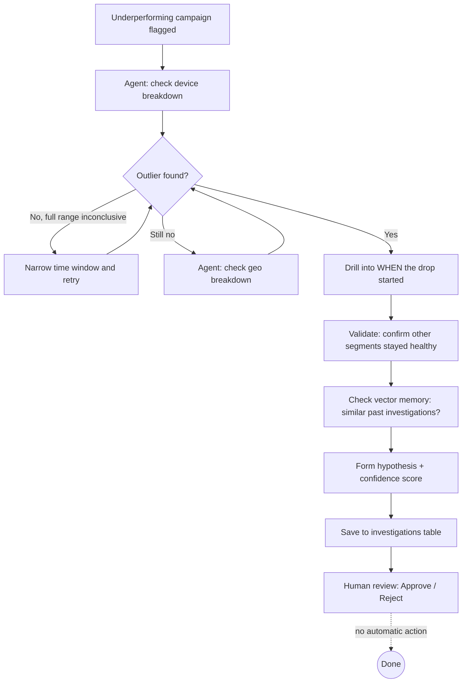

# Campaign Performance Investigator

An agent that investigates *why* a marketing campaign is underperforming —
not a chatbot, not a dashboard. Given a campaign that's over its target
CPA, it plans an investigation, queries the data itself, adapts its
approach when an initial query is inconclusive, validates its own
conclusion, and hands a marketing analyst a evidence-backed hypothesis to
approve — it never changes spend, pauses a campaign, or contacts anyone
on its own.

Built as a portfolio project to demonstrate agentic AI system design for
Data Analyst / AI Engineer roles: multi-step planning, tool selection,
self-validation, vector memory (RAG), structured logging, and a real
evaluation suite with a measured accuracy result — not just "it worked
when I tried it."

## The problem it solves

Marketing/analytics teams routinely burn analyst hours manually
drilling into "why did this campaign underperform" — checking device
breakdowns, geo breakdowns, time trends, one query at a time. This agent
automates *the investigation*, not the decision: it does the tedious
multi-step SQL digging and hands a human a ranked hypothesis with
evidence, so the analyst's time goes to judgment, not query-writing.

## Architecture



## What makes this genuinely agentic (not just a script)

- **Plans multi-step**: decides which dimension to check first, and
  whether to keep digging based on what it finds
- **Adapts to inconclusive results**: when a full-range average hides an
  anomaly (diluted by healthy days before the issue started), it narrows
  the time window and retries — this exact gap was found and fixed via
  the evaluation suite (see `eval/EVALUATION_REPORT.md`)
- **Chooses between tools**: device breakdown, geo breakdown, time trend,
  and vector memory search are all available; which ones get used depends
  on what earlier steps found
- **Validates its own conclusion** before finalizing, rather than
  reporting the first pattern it notices
- **Uses memory**: retrieves similar past investigations via a vector
  store, so recurring patterns get recognized instead of re-investigated
  from scratch
- **Human-in-the-loop by design**: the agent's only possible outputs are
  a report and a database write to its own findings table — it has no
  code path that can change a campaign, spend, or notify anyone

## Tech stack

| Layer | Technology | Why |
|---|---|---|
| Data | SQLite (schema in `src/schema.sql`) | Real multi-table relational data — campaigns, daily metrics, investigations, audit trail, embeddings |
| Agent orchestration | Hand-rolled Python state machine (`src/agent.py`) | No network access in dev sandbox to install LangGraph — this implements the same plan/act/observe/adapt idea directly; `src/agent_llm.py` has a real Anthropic tool-calling version to run with API access |
| LLM integration | Anthropic API, tool/function calling (`src/agent_llm.py`) | Real model-driven investigation instead of fixed rules |
| Memory / RAG | TF-IDF + cosine similarity (`src/memory.py`) | Fully local, zero-dependency vector search; swap `_embed_texts()` for a real embedding API to upgrade |
| Dashboard | Streamlit (`src/dashboard.py`) | Shows the live investigation trace + human approval flow |
| Observability | Structured JSON logging (`src/observability.py`) | Every SQL query timed and logged, separate from the business-record audit trail |
| Deployment | Docker + docker-compose | Self-seeding container, persistent named volume for the database |
| Evaluation | Custom eval harness (`eval/`) | 8 synthetic ground-truth scenarios, scored for dimension/value accuracy and false positive rate |

## Evaluation results

**100% dimension accuracy, 100% exact-value accuracy, 0 false positives,
0 false negatives** across 8 synthetic ground-truth scenarios (device and
geo anomalies of varying severity, plus healthy controls).

The first run scored 75% — full details on the bug that caused it, the
fix, and known limitations are in **`eval/EVALUATION_REPORT.md`**. That
file is worth reading before an interview: it documents a real gap found
by testing, not just a final number.

## Project structure

```
campaign-investigator/
├── src/
│   ├── schema.sql                  # 5-table schema
│   ├── generate_seed_data.py       # synthetic demo data w/ planted anomaly
│   ├── sql_tool.py                 # read-only, audited SQL execution tool
│   ├── detect_underperformance.py  # flags campaigns over target CPA
│   ├── agent.py                    # deterministic investigation loop
│   ├── agent_llm.py                # real Anthropic tool-calling version
│   ├── persistence.py              # saves/loads investigations + human review
│   ├── memory.py                   # vector memory / RAG over past investigations
│   ├── observability.py            # structured JSON logging
│   └── dashboard.py                # Streamlit UI
├── eval/
│   ├── generate_eval_dataset.py    # independent ground-truth test scenarios
│   ├── run_evaluation.py           # scores agent against ground truth
│   └── EVALUATION_REPORT.md        # results + honest limitations
├── data/campaigns.db               # demo database (auto-generated if missing)
├── Dockerfile / docker-compose.yml / entrypoint.sh
└── requirements.txt
```

## Running it

**Quickest (Docker):**
```
docker compose up --build
```
Open `http://localhost:8501`.

**Locally:**
```
pip install -r requirements.txt
python src/generate_seed_data.py    # only needed once
streamlit run src/dashboard.py
```

**Run the evaluation suite:**
```
python eval/generate_eval_dataset.py
python eval/run_evaluation.py
```

**Run the real LLM-driven agent** (needs an Anthropic API key):
```
export ANTHROPIC_API_KEY=your_key_here
python src/agent_llm.py
```

## Known limitations

- The rule-based `agent.py` only tests one failure pattern: a sustained
  conversion-rate drop isolated to one device or geo segment. It hasn't
  been evaluated against gradual declines or multi-dimensional anomalies.
- Vector memory uses TF-IDF, not true semantic embeddings, due to no
  network access during development — see the note in `memory.py` for
  the upgrade path.
- `agent_llm.py`'s real API-driven behavior hasn't been run end-to-end
  in this environment (no network access) — the deterministic version is
  what's been fully tested; the LLM version should be run and observed
  on your own machine before treating it as demo-ready.

## What I'd build next

- Multi-dimensional anomaly detection (e.g. mobile *and* a specific geo
  together)
- Real embedding-based memory (Voyage AI or OpenAI)
- Slack/email drafting for approved findings (still requiring a human
  send action, never automatic)
- A/B testing the LLM-driven agent against the rule-based one on the same
  eval suite, to quantify what real reasoning adds over fixed heuristics
